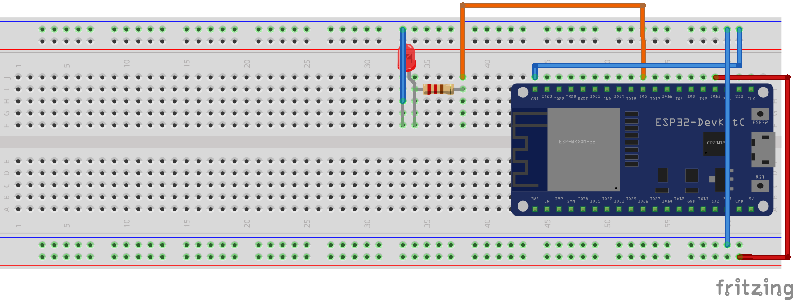
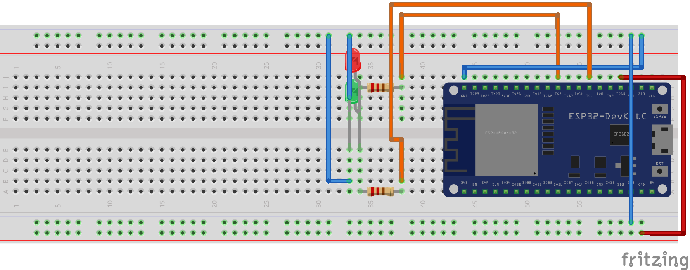
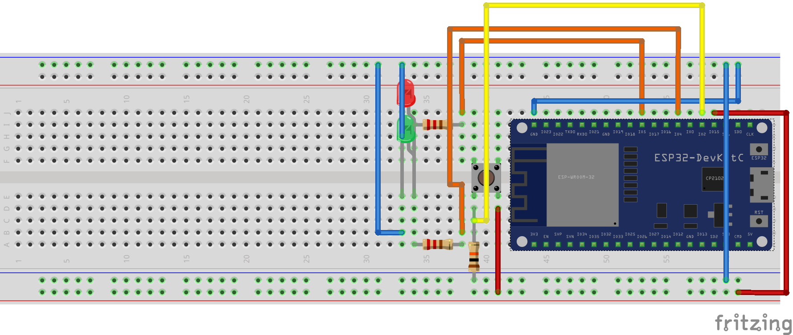

# ESP32 source code for the Cloudway "IoT in the Cloud" workshop

This is the basic source code for the workshop, we also provided some basic commands and information.


## ESP32 Drivers + Mongoose Os Installation

Check [mongoose-os.com](https://mongoose-os.com) for more in depth information about mongoose-os. Which is an awesome IoT framework.

## ESP32 (WROOM-32) Some information

| [Datasheet](https://www.espressif.com/sites/default/files/documentation/esp32-wroom-32_datasheet_en.pdf) | [Projects](https://hackaday.io/projects?tag=ESP32) |

The ESP32 is a micro-controller that has a lot off built-in functionality.
It support, Bluetooth and WiFi out of the box. It also features lots of PINS which can almost always do GPIO tasks but each of them provides more than one functionality. See Pin Layout for the different setups.

The ESP32 has an onboard ROM chip with some additional chips for encryption etc.
For more information check the datasheet.

### Pin Lay-out


## Mongoose Os 

| [Mongoose Os documentation](https://mongoose-os.com/docs) | [Quickstart guide](https://mongoose-os.com/docs/quickstart/setup.md) |

You can use the quick start guide and follow the first 7 steps to get started.
This should get you far enough to have WiFi running. For the demo we provide an Access Point that can be used to connect your ESP32 to the internet.

### Use-full Commands

Here is a list of commands you are going to need during the workshop. You can find other commands by checking the [documentation](https://mongoose-os.com/docs). But this list should do.

_For the commands to work you need to have MOS installed with the CP2021N Drivers for your system which allows serial communication over USB._

You can find the drivers for the ESP32-DevKitC (The board we are using) by clicking [here](https://www.silabs.com/products/development-tools/software/usb-to-uart-bridge-vcp-drivers)

Always enter ` mos ` before a mos command fi. ` mos console ` and set the "PORT" that is used for Serial Communication.

``` 
// MAC & Linux port instructions
ls -lah /dev/cu.*
export MOS_PORT=SERIAL_DEVICE_FROM_ABOVE_COMMAND_HERE

// or

mos [command] --port SERIAL_DEVICE_FROM_ABOVE_COMMAND_HERE

// For Windows

mos [command] --port COM[NUMBER]
```

` build `

This command will package your firmware for the targeted device (esp32, can be found in mos.yml). By sending your code to the mongoose.cloud which compiles the firmware for the ESP32 and sends a zip back which can be deployed on the ESP32.

You only need to do this once after that you can use `mos put [file]` to update your code on the ESP32.

` flash `

Flash is used to FLASH the ROM of the ESP32 with the new firmware. This is what you run after a `build` to write the new build onto the ROM.

` put `

This command will put a file from your computer onto the ESP32. You will use this a lot to put your code on the ESP32.

Example: `mos put fs/init.js` will upload the init.js file to the ESP32 (overriding the old one)

` wifi `

To setup WIFI for your ESP32 you can run the wifi command with a SSID (name of the wifi AP) and the password.

Example: `mos wifi AP-2222 50M31337P455W04D`

` console `

Console will show you the messages printed by the ESP32. This command will run until you stop it, this can be done by pressing ctrl+c.

` ui `

This will open a WebUI which can be used to run commands and view the console output, in a bit more user-friendly environment.

` aws-iot-setup `

This will setup a connection with AWS-IOT for your device. 

It's important to know that you need AWS credentials (and setup your ENV variables) and a WIFI connection to do this.

` call `

Allows you to run Mongoose OS API calls on the ESP32

Example: ` mos call Sys.Reboot ` this will reboot the ESP32

` get-config ` & ` set-config `

Can be used to get and manipulate the configuration of the ESP32.

Example: ` mos get-config device.id ` will return you devices ID (which is also used for Identification with the AWS IoT service).

## MJS

For this Workshop we decided to use JavaScript which is supported by Mongoose OS, you can also use C. But JavaScript is easier for most users.

Mongoose OS Runs MJS which is a striped down version of JavaScript also some of the C features are not supported (yet) for JavaScript.

Make sure to check the documentation. Also, you can't use certain JavaScript basic features. If you do the error might be hard to spot at first but somewhere in your console output it will show a message with a prefix: `[MJS]` and then some information. 

This information is important to debug the error.

For more information and limitations check the [MJS Github Page](https://github.com/cesanta/mjs) 

### MJS Restrictions

- No standard library. No String, Number, RegExp, Date, Function, etc.
- **`JSON.parse()`** and **`JSON.stringify()`** are available.
- No closures, only lexical scoping (i.e. nested functions are allowed).
- No exceptions.
- No `new`. In order to create an object with a custom prototype, use
  **`Object.create()`**, which is available.
- Strict mode only.
- No `var`, only `let`.
- No `for..of`, `=>`, destructors, generators, proxies, promises.
- No getters, setters, `valueOf`, prototypes, classes, template strings.
- No `==` or `!=`, only `===` and `!==`.
- mJS strings are byte strings, not Unicode strings: `'ы'.length === 2`,
  `'ы'[0] === '\xd1'`, `'ы'[1] === '\x8b'`.
  mJS string can represent any binary data chunk.

## Code Examples

### MqTT Wait for Connection

```JS
let MQTT_STATE = 1;

function init () {
    // Your code that requires mqtt here

    MQTT.pub("topic", "message", 0);
}

MQTT.setEventHandler(function (conn, ev, edata) {
  if (ev !== 0) print('MQTT event handler: got', ev);

  if (ev === MQTT.EV_CONNACK) {
    print("Connection Accepted");
    MQTT_STATE = 1;

    init();
  
  } else if (ev === MQTT.EV_CLOSE) {
    print("Connection Lost");
    MQTT_STATE = 0;
  }
}, null);
```


### Simple Timer

```JS
Timer.set(1000, Timer.REPEAT, function () {
    // Alternative for a loop, send a message every secoond if connected.
    if (MQTT_STATE === 1) {
        MQTT.pub(...)
    }
}, null);
```

### GPIO Example

```JS
let BTN = 2;
let LED_GREEN = 4;

let ADDITIONAL_POWER = 17;

let MQTT_STATE = 0;

// Use PIN 17 as an additional 3.3v output pin :)
GPIO.set_mode(ADDITIONAL_POWER, GPIO.MODE_OUTPUT);

// Open the power flow by setting the GPIO pin to on
GPIO.write(ADDITIONAL_POWER, 1);

// Set the BTN Pin (2) as a input PIN
GPIO.set_mode(BTN, GPIO.MODE_INPUT);

// Set the LED_GREEN pin (4) as a output PIN
GPIO.set_mode(LED_GREEN, GPIO.MODE_OUTPUT);

// Set the LED_GREEN pin to off by writing a 0 to it 
GPIO.write(LED_GREEN, 0);
```

### GPIO Button
```JS
GPIO.set_button_handler(BUTTON, GPIO.PULL_UP, GPIO.INT_EDGE_NEG, 200, function(x) {
    GPIO.toggle(LED_GREEN);
}, null);
```

### AWS Shadow
```JS
AWS.Shadow.setStateHandler(function(data, event, reported, desired, reported_metadata, desired_metadata) {
    if (event === AWS.Shadow.CONNECTED) {
        // INIT code here
    } else if (event === AWS.Shadow.UPDATE_DELTA) {

        // MAPS Desired keys onto the state 
        for (let key in state) {
            if (desired[key] !== undefined) state[key] = desired[key];
        }
        
        // Report the updated state
        AWS.Shadow.update(0, state);  // Report device state
    }
    
    print(JSON.stringify(reported), JSON.stringify(desired));
}, null);
```

### Wiring

#### Wiring notes

Some things to keep in mind while working with electronics:

- Don't connect the power while doing the wiring
- Connect the ground first
- Never directly connect the ground and the voltage
- Use the right resistors
  - We used 10k for the button and 430R for the led's
- Watch out for components touching each other (fi. led pin against a resistors pin) this can result in problems.
- Pins are fragile, watch out because you might break them
- Good color coding helps:
  - We used:
    - Orange for GPIO Output
    - Yellow for GPIO Input
    - Red for 3.3v
    - Blue for Ground

#### Initial setup



# Please try to do things yourself before looking down here :)

---
---
---
---

#### Part 2 setup


#### Part 3 setup


## Music Examples

```js
// K3
addNoteToMelody(NOTE.C5, 500);
addNoteToMelody(NOTE.A5, 500);
addNoteToMelody(NOTE.A5, 250);
addNoteToMelody(NOTE.G5, 500);

addNoteToMelody(NOTE.G5, 500);
addNoteToMelody(NOTE.F5, 250);
addNoteToMelody(NOTE.E5, 250);
addNoteToMelody(NOTE.F5, 500);
addNoteToMelody(NOTE.F5, 500);
addNoteToMelody(NOTE.E5, 500);


addNoteToMelody(NOTE.E5, 250);
addNoteToMelody(NOTE.D5, 250);
addNoteToMelody(NOTE.C5, 250);
addNoteToMelody(NOTE.D5, 500);
addNoteToMelody(NOTE.F5, 500);
addNoteToMelody(NOTE.A5, 250);
addNoteToMelody(NOTE.A5, 250);
addNoteToMelody(NOTE.G5, 250);
addNoteToMelody(NOTE.F5, 500);
addNoteToMelody(NOTE.A5, 500);
addNoteToMelody(NOTE.Bb5, 500);
addNoteToMelody(NOTE.G5, 500);
```

```js
// Smoke on the Water
addNoteToMelody(NOTE.E5, 500);
addNoteToMelody(NOTE.G5, 500);
addNoteToMelody(NOTE.B5, 800);
addNoteToMelody(NOTE.E5, 500);
addNoteToMelody(NOTE.G5, 500);
addNoteToMelody(NOTE.Bb5, 300);
addNoteToMelody(NOTE.A5, 900);
addNoteToMelody(NOTE.E5, 500);
addNoteToMelody(NOTE.G5, 900);
addNoteToMelody(NOTE.B5, 750);
addNoteToMelody(NOTE.G5, 500);
addNoteToMelody(NOTE.E5, 1200);
```

```js
// Jingle Bells
addNoteToMelody(NOTE.A5, 500);
addNoteToMelody(NOTE.R, 100);
addNoteToMelody(NOTE.A5, 500);
addNoteToMelody(NOTE.R, 100);
addNoteToMelody(NOTE.A5, 1000);

addNoteToMelody(NOTE.R, 100);
addNoteToMelody(NOTE.A5, 500);
addNoteToMelody(NOTE.R, 100);
addNoteToMelody(NOTE.A5, 500);
addNoteToMelody(NOTE.R, 100);
addNoteToMelody(NOTE.A5, 1000);
addNoteToMelody(NOTE.R, 100);

addNoteToMelody(NOTE.A5, 500);
addNoteToMelody(NOTE.R, 100);
addNoteToMelody(NOTE.C6, 500);
addNoteToMelody(NOTE.R, 100);
addNoteToMelody(NOTE.F5, 500);
addNoteToMelody(NOTE.R, 100);
addNoteToMelody(NOTE.G5, 500);
addNoteToMelody(NOTE.R, 100);
addNoteToMelody(NOTE.A5, 2000);
addNoteToMelody(NOTE.R, 100);

addNoteToMelody(NOTE.AS5, 500);
addNoteToMelody(NOTE.R, 100);
addNoteToMelody(NOTE.AS5, 500);
addNoteToMelody(NOTE.R, 100);
addNoteToMelody(NOTE.AS5, 1000);
addNoteToMelody(NOTE.R, 100);

addNoteToMelody(NOTE.AS5, 500);
addNoteToMelody(NOTE.R, 100);
addNoteToMelody(NOTE.A5, 500);
addNoteToMelody(NOTE.R, 100);
addNoteToMelody(NOTE.A5, 1000);
addNoteToMelody(NOTE.R, 100);

addNoteToMelody(NOTE.A5, 500);
addNoteToMelody(NOTE.R, 100);
addNoteToMelody(NOTE.G5, 500);
addNoteToMelody(NOTE.R, 100);
addNoteToMelody(NOTE.G5, 500);
addNoteToMelody(NOTE.R, 100);
addNoteToMelody(NOTE.A5, 500);
addNoteToMelody(NOTE.R, 100);
addNoteToMelody(NOTE.G5, 1000);
addNoteToMelody(NOTE.R, 100);
addNoteToMelody(NOTE.C6, 1000);
addNoteToMelody(NOTE.R, 100);

```