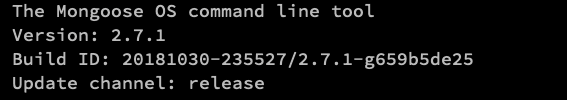
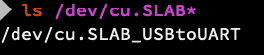

# MOS Installation + Drivers

> If you already installed the MOS tools, you are free to skip this part and go back to where ever you came from 

We will need the MOS tool to send commands and data to our device. The installation that you require depends on your operating system.
You can follow the official steps from the Mongoose OS site if you like to: [Mongoose OS Startup Guide](https://mongoose-os.com/docs/quickstart/setup.md) or follow the steps down here.

### Windows
Download mos.exe from the official mongoose-os website or [click here](https://mongoose-os.com/downloads/mos-release/win/mos.exe) to start your download directly.

It is recommended to save the mos.exe file on your `c:\` drive under the folder `c:\mos`. This allows for easier and quicker access.
I also recommend that you add `mos.exe` to your startup path. Which can be done by following these steps:

> //TODO I need access to a windows machine for proper screenshots

### MacOS
For MacOS we recommend using brew (just like the mongoose startup guide is recommending) you can download and install brew from here: [brew - the missing package manager for macOS](https://brew.sh/)

After that you will need to add the MongooseOS 'tap' which allows you to download the mos package.

Open up a Terminal (we expect that you know how).

```sh
brew tap cesanta/mos
brew install mos
```

Make sure to test your installation by running:

```sh
mos version
```

You should see something like this:



### Ubuntu Linux

For Linux, you will only need to do some basic steps including adding the repoistory from which to donwload the mongoose os command line tool:

```sh
sudo add-apt-repository ppa:mongoose-os/mos
sudo apt-get update
sudo apt-get install mos
```

After that you can run the following command to test your setup

```sh
mos version
```

## Installing drivers for your controller

For our guide we used the DevKitC board with an ESP-Wroom-32 chip. You will need the drivers required for your board, which depends on the USB to UART Bridge chip on your board. For our board it was the `CP2102N` chip. The drivers for this chip can be found on the Silicon Labs website by [clicking here](https://www.silabs.com/products/development-tools/software/usb-to-uart-bridge-vcp-drivers).

The installation is straight-forward click next. If you finished the installation and hook up your board to the computer you test if the drivers where setup correctly by running:

### Linux/Unix (MacOS)
```sh
ls /dev/cu.SLAB*
```

This should show you something like:

;

### Windows

For windows devices you can check if everything works by going to your hardware and devices menu ...

> //TODO Requires a Windows os for checking and making screenshots

## Installing the AWS CLI
If you are going to use the ESP32 with AWS you will need the AWS CLI to connect to the cloud.

You can install the AWS CLI from the following page [https://aws.amazon.com/cli/](https://aws.amazon.com/cli/). For Linux/Unix you will need Python which can be installed from here [https://www.python.org/](https://www.python.org/) and then you should install the AWS CLI with PIP:

```sh
pip install awscli
```

## Last words

When you finished setting up the basics, you can go back to the guided tutorials and start following the steps however there are some tips:

- Create a folder for your project files
- You can run `mos` to start the web based User Interface which might be easier if you are not familiar with the Command Line
- We used a Macbook with MacOS Mojave 10.14 to create the guides and projects. Be aware of this.

