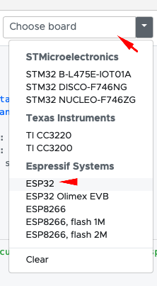
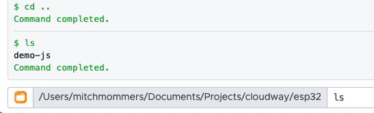
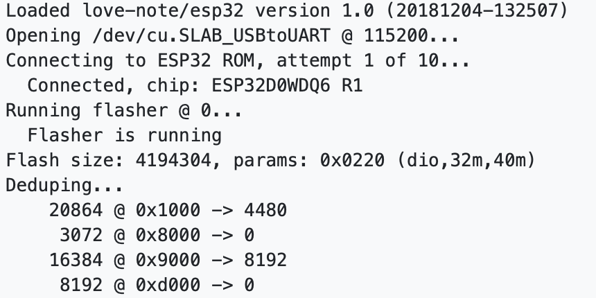

# The Extended Love Note

> ## Make sure to finish basic setup first!
> We wrote a basic installation manual which you can find here: [Basic Installation](https://github.com/becloudway/iot-in-the-cloud-workshop/tree/master/guided/installation). 
> You can also use the Quickstart guide from Mongoose Os which can be found here [Quick Start Guide - Mongoose Os](https://mongoose-os.com/docs/quickstart/setup.md) finish step 1 to 3 and you should be fine. But you would still need to install GIT and the AWS CLI.

## What you will be making?

For this "challenge" we will create an ESP32 with buzzer (piezo element). That plays a note that it receives from a lambda, which sends this note over MqTT.
It will also send feedback by using the device shadow to send the last played notes.

This is the extended version of this challenge because I added a lambda to send the notes and also an example of an IoT Shadow, you can do it without lambda by using the AWS IoT Service to publish the "note". To do this you can go to the AWS IoT Console and use the test option in the menu (As you can see later when we test our ESP32, before making the lambda).

## What you will need

- ESP32 (or another device that runs Mongoose Os)
- Breadboard
- Piezo (Buzzer) element
- Some wires to hook everything up
- A laptop with MOS (Mongoose Os Tool) installed
- Access Point with basic WPA2 auth (ssid & password) to connect your device to the internet

Optional:

- A resistor (to lower the volume) ranging from 60k upto 1m depending on your setup
  - I used a 330k resistor

## The wiring

The wiring for this guide is pretty straightforward we use a Piezo buzzer and wire it to a PWM enabled pin.
You can follow the fritzing down here or try it on your own. For our DevKitC board we used pin 5 as PWM output pin.

If you whant to read more about Pulse Width Modulation read this article on [sparkfun](https://learn.sparkfun.com/tutorials/pulse-width-modulation/all).

> Make sure to wire the ground correctly. In our case there is a `+` sign on the buzzer that shows us how to wire it we connect the negative `-` side to the ground.

> You can incease and decrease the volume by increasing and decreasing the resistance.


## Programming the ESP32

We will do this step by step, if you follow the steps correctly you will be fine. For eas of use (and a more generic guide) we will be using the MOS UI.

### Before we start with coding ...

We recommend that you create a folder for your ESP projects. It doesn't really mather whereas long as your remember the path.
In this folder we will start, you can start by opening up the MOS Tool:

#### Linux/Unix

```sh
mos ui
```

#### Windows

For windows, we recommend to start by clicking on the mos.exe file this should do the trick.

### The mos UI

Once you started the UI you will see the following (on linux it will open up a browser window):


The screen is devided in some textaraea's and dropdown menu's the nummber that you see above mean:

1. Here you will see the output of your **commands**
2. Here you will see the output from your **device**
3. here you can select the port used to communicate with your device
4. Here you can select the type of device that you are using
5. Here you can enter commands (os spefific fi. ls and mos commands).

Now start with selecting the right port, you can do this by selecting the dropdown box and selecting the right port for linux/unix users this will be `/dev/cu.SLAB_USBtoUART` (or alike) for windows users it can be a port that starts with `COM` followed by a number fi. `COM3`.


If your device type isn't selected yet, than do so by selecting the dropdown-box and clicking on `esp32`.



Next up is navigating to our workspace (folder). You can do this by selecting the orange folder box button  and navigating to your workspace folder.

Another option is to use command input to enter commands.



When you get into the right folder, you can continue to the next step.

## Cloning the boilerplate

> For this part your need GIT installed or you can download the zip file and unzip it on your computer. We are going to show the GIT method. The boilerplate however can be found here: [https://github.com/becloudway/iot-in-the-cloud-workshop-boilerplate](https://github.com/becloudway/iot-in-the-cloud-workshop-boilerplate)

You can clone the boilerplate by using the command down here:

```sh
git clone --depth=1 --branch=master https://github.com/becloudway/iot-in-the-cloud-workshop-boilerplate.git love-note && rm -rf love-note/.git
```

This will clone the project and remove the .git history etc. so that you have a clean folder to work with.

## Let's get started

### Step 1

Now in your MOS UI navigate towards the folder using the  icon.
The folder's name should be love-note.

Your path should look something like this.

```
Windows: c:\users\youruser\...\workspace\love-note

Unix\Linux: /Users/youruser/.../workspace/love-note
```

When you run the following command:

```sh
// windows
tree

// Linux/Unix
find .
```

It should show you the following file/folder structure:


The most important files are `./mos.yml` and `./fs/init.js` so let me explain these to you.

`mos.yml`

This is the mos definition file used for building your project, it contains references to the libraries you use and information about your target platform etc. You can open the file and check it out if you like but we did the setup for you.

`./fs/init.js`

This file holds your code, in this file we will be working.

### Step 2

Let's open `./fs/init.js` in your favorite code editor, so that we can start coding.

When you open the file it should have the following content:

```js
// Load some dependencies
load('api_aws.js');
load('api_config.js');
load('api_gpio.js');
load('api_mqtt.js');
load('api_timer.js');
load('api_sys.js');
load('api_pwm.js');

/*
* We used pin 15 as an additional 3.3v power pin because our breadboards where a bit to small :D
* But as you can see we got a workaround for that.
*/

// ----------------------- THIS PART IS FOR 3.3v POWER ON PIN 15
let ADDITIONAL_POWER = 15;

GPIO.set_mode(ADDITIONAL_POWER, GPIO.MODE_OUTPUT);
GPIO.write(ADDITIONAL_POWER, 1);
// ----------------------- DON'T CHANGE THIS

// Where your code starts
// You can remove the timer down here.

Timer.set(1000, Timer.REPEAT, function () {
    print("Hello World!");
}, null);
```

The first lines load the modules that we use in our code, fi. the aws api so that we can communicate with AWS. But it also loads basic functionality from mongoose os.

For the tutorial we will focus on everything underneath the following line:

```js
// Where your code starts
```

There is a timer down there so we will first check if everything is set up correctly. We will do this by finally running a program on our ESP32.

So how do we get started, well make sure that you now connect your ESP32 to your computer. And open up the MOS UI.
Make sure that you are connected to your device and selected the right device type.


Next enter the following command: `mos build` this will send your code and mos.yml towards the mongoose cloud server that builds your code and sends back a nice packaged firmware that you can flash onto your device.

Your output should look similar to this:


> If you whant to learn more about flashing and firmware [click here](https://en.wikipedia.org/wiki/Firmware) :)

Now we need to flash our firmware onto our device. We can do this by running `mos flash` this will start the flashing process as you can see in the left panel. This can take some time.



When all that flashing is done, our project will start up and show us some `hello world!` in the right panel.


That's it for this part, now you have a running `hello world` example, congratulations!

### Step 3

Now let's get down to business, we will need to write some code that allows us to connect to AWS and receive a MqTT message.
So to start we will remove the timer because we don't need that one anymore. When that is removed, we can start coding below.

```js
// Where your code starts
```

We will need 3 things:

- A subscription on a MqTT topic
- Code that updates our shadow
- A function to play notes

But we will start with defining our pin.

To do so we will need the following code:

```js
let PIEZO_PIN = 5;
PWM.set(PIEZO_PIN, 0, 0);
```

which means that we assign the value of `5` to our variable `PIEZO_PIN`. We write the variable name (PIEZO_PIN) in capital letters to make it clear that it is a constant (we don't whant to change its value anymore). The `PWM.set` method takes 3 arguments: the pin, the frequency and the width (percentage of time to be high). 

By setting the frequency and width to 0 we will basically mute the tone. We do this because sometimes pins still have current going and if so we will get an annoying tone.

Now let's write a function that plays a tone, to so we first have to define our notes:

An easy way to do this is by mapping our notes to a certain frequency so add the following piece of code:

### Step 4 - Play Notes

```js 
// NOTE object maps Frequencies to Notes
let NOTE = {
    C5: 523,
    CS5: 554,
    D5: 587,
    DS5: 622,
    E5: 659,
    F5: 698,
    FS5: 740,
    G5: 784,
    GS5: 831,
    A5: 880,
    AS5: 932,
    Bb5: 920,
    B5: 988,
    C6: 1047,
    R: 0
};
```

Here we have an `Object` called `NOTE` which contains some keys, that each have an frequence assigned to them.
We can access these notes by doing `NOTE.C5` which will give us the value `523`.

So now that we have our NOTE object we can start writing a function that plays the note, that you pass as an agurment.

```js
// Accepts a note (which is a string) that exists in the NOTE object.
function playNote(note) {
    // Play the note
    PWM.set(PIEZO_PIN, NOTE[note], 0.75);

    // After 1 second stop playing the note
    Timer.set(1000, 0, function() {
        PWM.set(PIEZO_PIN, 0, 0);
    }, null);
}

// Call the playNote function with as note parameter G5
playNote("G5");
```

To test this open up your MOS UI and run the following commands.

```sh
mos put fs/init.js
mos call Sys.Reboot
```

This will send the updated code to your device and reboot the system. When that is done, you should hear a beeping G5.

### Step 5 - Connecting To AWS

Now that we can play a note the easy part is over, because now we need to connect to AWS. We will start with logging in to the AWS console. If you don't have an account make sure to register (for our workshop we provide accounts). 

So let's get started by going to the AWS console by [clicking here](https://eu-west-1.signin.aws.amazon.com). Enter you alias, username and password (during the workshop you will get our alias, iam username and password). Hit `Sign In`.

Now that you are in the AWS Console you have to find IAM, you can do this by clicking the search box and enter `iam` and then clicking on `IAM`.


Now you should see the IAM Console


On the left you can click on `Users` which should bring you to the user list, here you should click on your user.

Now go to the `Security Credentials` tab.


Scroll down a bit and you will find the `Create access key` button, click on it and it will show you the following pop-up.


Make sure to hit `download .csv file` to save your credentials and if you like you can copy and note your `access key id` and `secret access key`. You will need these in the next step.

Now go back to the MOS UI for the next part.

Next there are two things that you need to do:

1. Connecting your ESP32 to the WIFI
2. Setup AWS IOT for your ESP32

Both are easy thanks to the people of Mongoose Os.

**Connecting to WIFI**

Open up the MOS UI and enter the following command:

```sh
mos wifi <SSID> <WIFI_PASSWORD>
```

Replace <SSID> with your WiFi accespoints SSID and WIFI_PASSWORD with your WiFi password.

When everything goes well you should see a message like:

```sh
mgos_net_on_change_c WiFi STA: connected
```

**Setting up AWS IoT**

Lets setup our AWS credentials:

Open up a terminal and enter the following command.

```sh
aws configure
```

When prompted enter your access key id and secret key. For the region enter `eu-west-1` and for default output format just hit enter.

Now restart MOS UI to make sure that it loaded your new credentials.

If you did setup your AWS credentials correctly it should be as easy as entering:

```sh
mos aws-iot-setup
```

This will run some commands using the AWS CLI and create the required certificates. Then it will upload the certificates to your device and connect to AWS.

That's it you are now connected to AWS, congratulations!

### Step 6 - MqTT

Now lets start some communication with the cloud!

> For more information about the MQTT API go to the [Mongoose OS MqTT documentation](https://mongoose-os.com/docs/mos/api/net/mqtt.md)

First off we need some code to see if we are connected, we can do this with the following code snippets.

First we add a function that we call when we connect to MqTT:

```js
function mqtt_init () {
    print("MqTT init is called")
    // Some more code here, fi. sending a message
}
```

Then we create an EventHandler on the MQTT library which allows us to receive updates from the MQTT library and reacting on them:

```js
MQTT.setEventHandler(function (conn, ev, edata) {
  if (ev !== 0) print('MQTT event handler: got', ev);

  if (ev === MQTT.EV_CONNACK) {
    print("Connection Accepted");

    mqtt_init();
  
  } else if (ev === MQTT.EV_CLOSE) {
    print("Connection Lost");
  }
}, null);
```

The `MQTT.EV_CONNACK` is called when the MqTT connection is accepted.
When this happens we call our `mqtt_init` function, the `setEventHandler` method will call the `function` that we defined as its argument when an event occurs.

We also need to subscribe to the topic on which we want to receive data. This can also be done with a method of the `MQTT` library. We do this as followed:


```js
MQTT.sub('iot/team_name/note', function(conn, topic, msg) {
    // This will print the message to the console.
    print('Topic:', topic, 'message:', msg);
}, null);
```

It would be easier to prepare our code to play a note by adding the following line to our `MQTT.SUB` function.

```js
playNote(msg);
```

Your code should now look like this:

```js

// --- SNIP ---


// Accepts a note (which is a string) that exists in the NOTE object.
function playNote(note) {
    // Play the note
    PWM.set(PIEZO_PIN, NOTE[note], 0.75);

    // After 1 second stop playing the note
    Timer.set(1000, 0, function() {
        PWM.set(PIEZO_PIN, 0, 0);
    }, null);
}

// Call the playNote function with as note parameter G5
playNote("G5");

function mqtt_init () {
    print("MqTT init is called")
    // Some more code here, fi. sending a message
}

MQTT.setEventHandler(function (conn, ev, edata) {
    if (ev !== 0) print('MQTT event handler: got', ev);
  
    if (ev === MQTT.EV_CONNACK) {
      print("Connection Accepted");
  
      mqtt_init();
    
    } else if (ev === MQTT.EV_CLOSE) {
      print("Connection Lost");
    }
}, null);

MQTT.sub('iot/team_name/note', function(conn, topic, msg) {
    // This will print the message to the console.
    print('Topic:', topic, 'message:', msg);
    playNote(msg);
}, null);
```

So basically that's it you can add some code to for instance to play a note when you connect to MQTT or when you disconnect. And probably you want to add some message validation etc. But this does the trick for now :D (later we will add a `device shadow`)

So go to your MOS UI and enter the following commands:

```sh
mos put fs/init.js
mos call Sys.Reboot
```

If everything went alright, you should here your G5 playing and in the console output your should see that the device connected to the WiFi and MqTT.

### Part 7 - Testing our code

Now lets head back to the AWS Console homepage. Here we will search for `IoT` and select `IoT Core` so far so good. You should now see the following page. If you do not, you might see the get started page if so just hit `the blue button`.


Click `Test` in the sidebar, now you should see the following page:


Now scroll down, go to `Publish` for topic name enter: `iot/team_name/note` and for the message clean out the box and fill in: `C5` to play a nice C5.

Not hit `Publish to topic` to send the message towards the topic and you should hear a C5 buzzer note.


### Part 8 - Lambda

For the final part, we will use a Lambda function to play our note this might seem silly, because it is a bit silly. But you can improve it afterwards!

So let's go back to the home screen of the AWS Console and search for Lambda. Select `lambda` and you should now see something like the following image:


At the left side there is a big orange button with the text `Create function` click on this button. 

Keep the `Author from scratch` choice and fill in a function name like: `iot_teamname_note_lambda`. Keep the Runtime like it is (because we are doing JS today).

For the Role select `custom role` a new window should open.

In this new window select for IAM Role `Create a new IAM Role` and change the role name to: `iot_teamname_note_role`. Now click `View Policy Document` and click on `Edit`.
Now you can edit the policy document. Remove the current content. Now copy and paste the following policy:

> p.s. this is not a secure way of doing this because you would be better of fine graining permissions, but for this workshop that is out of scope. [Read more about it here](https://docs.aws.amazon.com/IAM/latest/UserGuide/access_policies_boundaries.html)

```json
{
  "Version": "2012-10-17",
  "Statement": [
    {
        "Effect": "Allow",
        "Action": [
            "logs:CreateLogGroup",
            "logs:CreateLogStream",
            "logs:PutLogEvents"
        ],
        "Resource": "arn:aws:logs:*:*:*"
    },
    {
        "Effect": "Allow",
        "Action": [
            "iot:*"
        ],
        "Resource": "*"
    }
  ]
}
```

Now it should send you back to the `Create function` page and the `Existing role` should now contain your new role's name.

Hit `Create Function` the orange button and you should see the following page.


This is where you can edit your lambda's code the code that you are seeing right now should look something like this:

```JS
exports.handler = async (event) => {
    // TODO implement
    const response = {
        statusCode: 200,
        body: JSON.stringify('Hello from Lambda!'),
    };
    return response;
};
```

What happens here is that you export a method which is a `handler`. When AWS executes your lambda it will find this method and execute it.

The `event` property contains all the data passed on from AWS the content depends on how the method is called and by which service.

Our response is basically what we whant to send back when we finish our function. It's a HTTP response so `statusCode: 200` is an `OK` response and the body is a string containing `Hello from Lambda!`.

Let's test this small piece of code.

At the top of your page you should see an button with the text `Test`. Click on this button and it will show you the following screen:


Enter the values of the image above and hit `Create`. Now the window should close. When this is done, you can hit `Test` again to run your function and get a result.

It should be a big green box saying that it was sucesfull.

Now let's change our code to send the note we entered in our test case to our device.

We first need to add the AWS SDK which allows us to access AWS service from our function.

We do this by adding this line at the very beginning of the document.

```js
const AWS = require('aws-sdk');
```

Now we can set up the IotData module from the AWS SDK by adding the following line under the `const AWS ...` line.

```js
const iotdata = new AWS.IotData({endpoint: 'xxxxxxxxxxx.iot.eu-west-1.amazonaws.com'});
```

We need to change our endpoint uri, we can do this by going to the AWS IoT console (best in a new window/tab). And choosing for settings.

Copy the uri you see on this page:


Now replace the `endpoint: 'this part...'` with the right endpoint uri.

Now replace the **code inside the handler function** with the following code:

```js
    const params = {
        topic: 'iot/team_name/note',
        payload: event.note,
        qos: 0
    };

    let response = {
        statusCode: 200,
        body: "empty"
    };
    
    try {
       let result = await new Promise((resolve, reject) => {
            iotdata.publish(params, (err, data) => {
                if(err)
                    reject(err);
                else
                    resolve(data);
            });
        });


        response = {
            statusCode: 200,
            body: JSON.stringify(result)
        };
    } catch (ex) {
        response = {
            statusCode: 500,
            body: JSON.stringify(ex)
        };
    }

    return response;
```

The code should now look like this, except for the endpoint and the additional comments for explaining what the code does.

```js
// This import the AWS sdk so that we can access it's modules to use AWS services.
const AWS = require('aws-sdk');

// The endpount can be found in the AWS IoT Core Console under settings
// We now create an instance of the AWS IotData module to communicate with the AWS Iot service.
const iotdata = new AWS.IotData({endpoint: 'xxxxxxxxxxxxxx-ats.iot.eu-west-1.amazonaws.com'});

// This exports our handler function so that AWS Lambda can execute it. This is our point of entry for AWS Lambda.
exports.handler = async (event) => {
    
    // We create our PARAMS that we will for sending to MQTT
    // The 'topic' is our MqTT topic (destination) and the payload is what we whant to send.
    // QOS can be either 0 or 1.
    const params = {
        topic: 'iot/team_name/note',
        payload: event.note,
        qos: 0
    };

    // The response object is what we return when our function completes
    let response = {
        statusCode: 200,
        body: "empty"
    };
    
    // Because we want to return an error code when everything goes wrong we put our login in a try-catch block.
    try {
        // We use an Promise because  most of AWS services are Async which means that you send your request but the data will be send back later. So we await a response using a promise.
       let result = await new Promise((resolve, reject) => {

           // We call publish on our iotdata instance wich will publish our payload to the topic we defined in the params const.
            iotdata.publish(params, (err, data) => {
                // When there is an error we reject (throw) the error
                if(err)
                    reject(err);
                // If there is no error we resolve (return) the data.
                else
                    resolve(data);
            });
        });

        // We set our response for success with a 200 - ok status code.
        response = {
            statusCode: 200,
            body: JSON.stringify(result)
        };
    } catch (ex) {
        // if an error occurs we log it to cloudwatch
        console.log(ex);
        // and return the error status code 500 with the error response as body.
        response = {
            statusCode: 500,
            body: JSON.stringify(ex)
        };
    }


    // Finally we return our error to AWS Lambda.
    return response;
};

```

Now hit `save` at the top of the page and wait a bit until the function is saved. When this is done hit the `Test` button again, after that you should hear a sound coming from your device.

So this is how you create a very basic lambda, now you can change things around, even make a API using AWS Api Gateway and play notes using a simple api gateway endpoint (url).

### Step 9 - AWS Snadow

So let's go, back to our ``favorite code editor`` and change our code a bit so that our device gets its own shadow.

Again Mongoose Os, supports AWS IoT Shadows out of the box and adding one is as easy as following these 3 steps:

1. Adding an object to keep state
2. Adding an shadowEventListener to recieve shadow updates
3. Updating your shadow when you feel like doing so

So let's start with creating an object, to keep our state. We do this by adding the following line to our code above the `function playNote(note) {` code block:

```js
let state = {lastPlayedNote: ''};
```

This state object contains our initial state. The next thing we need to do is add some code to listen for a shadow event and to start sending our state towards AWS. You can add this to the end of your file.

```js
AWS.Shadow.setStateHandler(function(data, event, reported, desired, reported_metadata, desired_metadata) {
    // Check if the event is a CONNECTED event, which occurs when your connected succesfull

    if (event === AWS.Shadow.CONNECTED) {
        // AWS Shadow connect code here
        playNote('B5');

        // Check if the reported state contains the lastPlayedNote, if not, than send it.
        if (reported.lastPlayedNote === undefined) {
            AWS.Shadow.update(0, state);
        }
    } else if (event === AWS.Shadow.UPDATE_DELTA) { // Check if there is a DELTA update

        // This for loop will loop through each key and update the state if there was an update on that key.
        for (let key in state) {
            if (desired[key] !== undefined) state[key] = desired[key];
        }
        
        // Now we send our updated shadow state back to AWS to confirm the state.
        AWS.Shadow.update(0, state);  // Report device state
    } 

    // And some logging to see what happens behind the screen.
    print(JSON.stringify(reported), JSON.stringify(desired));
}, null);
```

Finally, we change our `playNote` function by adding the following lines of code to the end of the function.

```js
    state.lastPlayedNote = note;
    AWS.Shadow.update(0, state);
```

This will update the state with the new note whenever you play one and send it to AWS.
Your full code should now look like this (without the comments, maybe?):

```js
// Load some dependencies
load('api_aws.js');
load('api_config.js');
load('api_gpio.js');
load('api_mqtt.js');
load('api_timer.js');
load('api_sys.js');
load('api_pwm.js');

/*
* We used pin 15 as an additional 3.3v power pin because our breadboards where a bit to small :D
* But as you can see we got a workaround for that.
*/

// ----------------------- THIS PART IS FOR 3.3v POWER ON PIN 15
let ADDITIONAL_POWER = 15;

GPIO.set_mode(ADDITIONAL_POWER, GPIO.MODE_OUTPUT);
GPIO.write(ADDITIONAL_POWER, 1);
// ----------------------- DON'T CHANGE THIS

// Where your code starts

let PIEZO_PIN = 5;
PWM.set(PIEZO_PIN, 0, 0);

// NOTE object maps Frequencies to Notes
let NOTE = {
    C5: 523,
    CS5: 554,
    D5: 587,
    DS5: 622,
    E5: 659,
    F5: 698,
    FS5: 740,
    G5: 784,
    GS5: 831,
    A5: 880,
    AS5: 932,
    Bb5: 920,
    B5: 988,
    C6: 1047,
    R: 0
};

let state = {lastPlayedNote: ''};

// Accepts a note (which is a string) that exists in the NOTE object.
function playNote(note) {
    // Play the note
    PWM.set(PIEZO_PIN, NOTE[note], 0.75);

    // After 1 second stop playing the note
    Timer.set(1000, 0, function() {
        PWM.set(PIEZO_PIN, 0, 0);
    }, null);

    state.lastPlayedNote = note;
    AWS.Shadow.update(0, state);
}

// Call the playNote function with as note parameter G5
playNote("G5");

function mqtt_init () {
    print("MqTT init is called")
    // Some more code here, fi. sending a message
}

MQTT.setEventHandler(function (conn, ev, edata) {
    if (ev !== 0) print('MQTT event handler: got', ev);
  
    if (ev === MQTT.EV_CONNACK) {
      print("Connection Accepted");
  
      mqtt_init();
    
    } else if (ev === MQTT.EV_CLOSE) {
      print("Connection Lost");
    }
}, null);

MQTT.sub('iot/team_name/note', function(conn, topic, msg) {
    // This will print the message to the console.
    print('Topic:', topic, 'message:', msg);
    playNote(msg);
}, null);

AWS.Shadow.setStateHandler(function(data, event, reported, desired, reported_metadata, desired_metadata) {
    // Check if the event is a CONNECTED event, which occurs when your connected succesfull

    if (event === AWS.Shadow.CONNECTED) {
        // AWS Shadow connect code here
        playNote('B5');

        // Check if the reported state contains the lastPlayedNote, if not, than send it.
        if (reported.lastPlayedNote === undefined) {
            AWS.Shadow.update(0, state);
        }
    } else if (event === AWS.Shadow.UPDATE_DELTA) { // Check if there is a DELTA update

        // This for loop will loop through each key and update the state if there was an update on that key.
        for (let key in state) {
            if (desired[key] !== undefined) state[key] = desired[key];
        }
        
        // Now we send our updated shadow state back to AWS to confirm the state.
        AWS.Shadow.update(0, state);  // Report device state
    } 

    // And some logging to see what happens behind the screen.
    print(JSON.stringify(reported), JSON.stringify(desired));
}, null);

```

Now you can send the code to your device and reboot it. And you can go to the AWS Console and go into the IoT Core screen. Here you can select `Manage` in the sidebar, and choose for `Things` in the sub menu.

You should see a overview of the Thing that are connected to this AWS Environment.

Here you can select your device, to see the ID of your device you can use the following command in your MOS UI.

```sh
mos config-get device.id
```

This will return your devices ID that is used as the device name for your AWS Thing. Now when you click on it, it should show you the following page.


In the left menu you can select `Shadow`, which should show you your device's shadow.


Now if you use your previously created lambda to send a note, the device shadow should update and your note should still play.

This was it for this tutorial, you learned how to create a basic lambda, how to set up the ESP32 for the Cloud and did some basic programming with the ESP32 and AWS. We hope that you enjoyed this guide and that you learned something new. If you think that we could improve certain aspects of our guide, feel free to let us know.