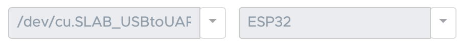
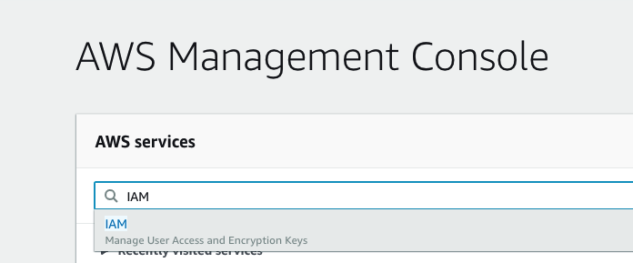
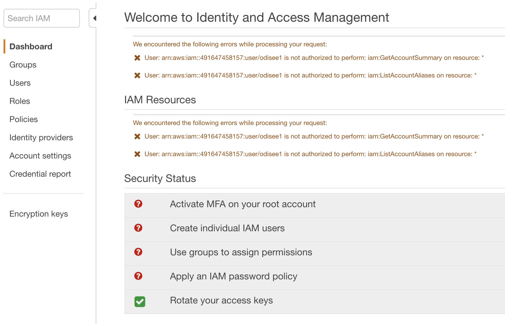
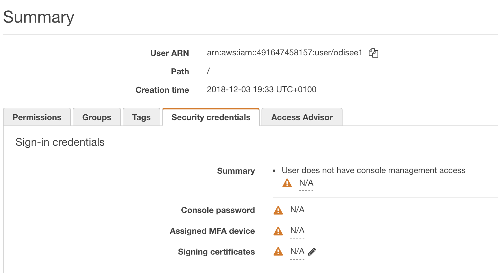
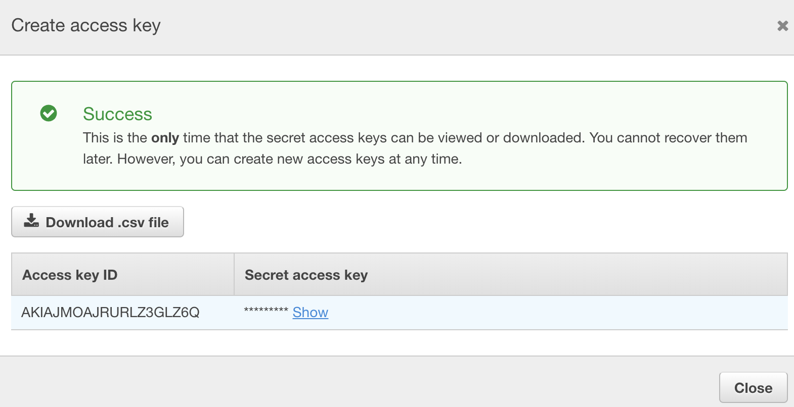

# The Extended Love Note

> ### Make sure to finish basic setup first!
> We wrote a basic installation manual which you can find here: [Basic Installation](../installation/readme.md). 
> You can also use the Quickstart guide from Mongoose Os which can be found here [Quick Start Guide - Mongoose Os](https://mongoose-os.com/docs/quickstart/setup.md) finish step 1 to 3 and you should be fine.

## What you will be making?

For this "challenge" we will create an ESP32 with buzzer (piezo element) that plays a note that it receives from a lambda which sends this note over MqTT.
It will also send feedback by using the device shadow to send the last played notes.

This is the extended version of this challenge because I added a lambda to send the notes, you can do it without lambda by using the AWS IoT Service to publish the "note". To do this you can go to the AWS IoT Console and use the test option in the menu (As you can see later when we test our ESP32, before making the lambda).

## What you will need

- ESP32 (or another device that runs Mongoose Os)
- Breadboard
- Piezo (Buzzer) element
- Some wires to hook everything up
- A laptop with MOS (Mongoose Os Tool) installed
- Access Point with basic WPA2 auth (ssid & password) to connect your device to the internet

Optional:

- A resistor (to lower the volume) ranging from 60k upto 1m depending on your setup
  - I used a 330k resistor

## The wiring

The wiring for this guide is pretty straightforward we use a Piezo buzzer and wire it to a PWM enabled pin.
You can follow the fritzing down here or try it on your own. For our DevKitC board we used pin 5 as PWM output pin.

If you whant to read more about Pulse Width Modulation read this article on [sparkfun](https://learn.sparkfun.com/tutorials/pulse-width-modulation/all).

> Make sure to wire the ground correctly. In our case there is a `+` sign on the buzzer that shows us how to wire it we connect the negative `-` side to the ground.

> You can incease and decrease the volume by increasing and decreasing the resistance.


## Programming the ESP32

We will do this step by step, if you follow the steps correctly you will be fine. For eas of use (and a more generic guide) we will be using the MOS UI. 

### Before we start with coding

We recommend that you create a folder for your ESP projects. It doesn't really mather whereas long as your remember the path.
In this folder we will start, you can start by opening up the MOS Tool:

#### Linux/Unix
```sh
mos ui
```

#### Windows

For windows, we recommend to start by clicking on the mos.exe file this should do the trick.

### The mos UI

Once you started the UI you will see the following (on linux it will open up a browser window):


The screen is devided in some textaraea's and dropdown menu's the nummber that you see above mean:

1. Here you will see the output of your **commands**
2. Here you will see the output from your **device**
3. here you can select the port used to communicate with your device
4. Here you can select the type of device that you are using
5. Here you can enter commands (os spefific fi. ls and mos commands).

Now start with selecting the right port, you can do this by selecting the dropdown box and selecting the right port for linux/unix users this will be `/dev/cu.SLAB_USBtoUART` (or alike) for windows users it can be a port that starts with `COM` followed by a number fi. `COM3`.


If your device type isn't selected yet, than do so by selecting the dropdown-box and clicking on `esp32`.


Next up is navigating to our workspace (folder). You can do this by selecting the orange folder box button  and navigating to your workspace folder.

Another option is to use command input to enter commands.


When you get into the right folder, you can continue to the next step.

## Cloning the boilerplate

> For this part your need GIT installed or you can download the zip file and unzip it on your computer. We are going to show the GIT method. The boilerplate however can be found here: [https://github.com/becloudway/iot-in-the-cloud-workshop-boilerplate](https://github.com/becloudway/iot-in-the-cloud-workshop-boilerplate)

You can clone the boilerplate by using the command down here:

```sh
git clone --depth=1 --branch=master https://github.com/becloudway/iot-in-the-cloud-workshop-boilerplate.git love-note && rm -rf love-note/.git
```

This will clone the project and remove the .git history etc. so that you have a clean folder to work with.

## Let's get started
### Step 1

Now in your MOS UI navigate towards the folder using the  icon.
The folder's name should be love-note.

Your path should look something like this.

```
windows: c:\users\youruser\...\workspace\love-note

Unix\Linux: /Users/youruser/.../workspace/love-note
```

When you run the following command:

```
// windows
tree

// Linux/Unix
find .
```

It should show you the following file/folder structure:


The most important files are `./mos.yml` and `./fs/init.js` so let me explain these to you.

`mos.yml`

This is the mos definition file used for building your project, it contains references to the libraries you use and about your target platform etc. You can open the file and check it out if you like but we  did the setup for you.

`./fs/init.js`

This file holds your code, in this file we will be working.

### Step 2

Now let's open `./fs/init.js` in your favorite code editor. So that we can start coding.

When you open the file it should have the following content:

```js
// Load some dependencies
load('api_aws.js');
load('api_config.js');
load('api_gpio.js');
load('api_mqtt.js');
load('api_timer.js');
load('api_sys.js');

/*
* We used pin 17 as an additional 3.3v power pin because our breadboards where a bit to small :D
* But as you can see we got a workaround for that.
*/

// ----------------------- THIS PART IS FOR 3.3v POWER ON PIN 17
let ADDITIONAL_POWER = 15;

GPIO.set_mode(ADDITIONAL_POWER, GPIO.MODE_OUTPUT);
GPIO.write(ADDITIONAL_POWER, 1);
// ----------------------- DON'T CHANGE THIS

// Where your code starts
// You can remove the timer down here.

Timer.set(1000, Timer.REPEAT, function () {
    print("Hello World!");
}, null);
```

The first lines load the modules that we use in our code, fi. the aws api so that we can communicate with AWS. But it also loads basic functionality from mongoose os.

For the tutorial we will focus on everything underneath the following line:

```js
// Where your code starts
```

There is a timer down there so we will first check if everything is setup correctly. We will do this by finally running a program on our ESP32.

So how do we get started, well make sure that you now connect your ESP32 to your computer. And open up the MOS UI.
Make sure that you are connected to your device and selected the right device type.



Next enter the following command: `mos build` this will send your code and mos.yml towards the mongoose cloud server that builds your code and sends back a nice packaged firmware that you can flash onto your device.

Your output should look similar to this:


> If you whant to learn more about flashing and firmware [click here](https://en.wikipedia.org/wiki/Firmware) :)

Now we need to flash our firmware onto our device. We can do this by running `mos flash` this will start the flashing process as you can see in the left panel. This can take some time.


When all that flashing is done. Our project will start up and show us some `hello world!` in the right panel.


That's it for this part, now you have a running `hello world` example, congratulations!

### Step 3

Now let's get down to business, we will need to write some code that allows us to connect to AWS and receive a MqTT message.
So to start we will remove the timer because we don't need that one anymore. When that is removed we can start coding below.

```js
// Where your code starts
```

We will need 3 things:

- A subscription on a MqTT topic
- Code that updates our shadow
- A function to play notes

But we will start with defining our pin.

To do so we will need the following code:

```js
let PIEZO_PIN = 5;
PWM.set(PIEZO_PIN, 0, 0);
```

which means that we assign the value of `5` to our variable `PIEZO_PIN`. We write the variable name (PIEZO_PIN) in capital letters to make it clear that his is a constant (we don't whant to change it's value anymore). The `PWM.set` method takes 3 arguments: the pin, the frequency and the width (percentage of time to be high). 

By setting the frequency and width to 0 we will basically mute the tone. We do this because sometimes pins still have current going and if so we will get an annoying tone.

Now let's write a function that plays a tone, to so we first have to define our notes:

An easy way to do this is by mapping our notes to a certain frequency so add the following piece of code:

### Step 4 - Play Notes

```js 
// NOTE object maps Frequencies to Notes
let NOTE = {
    C5: 523,
    CS5: 554,
    D5: 587,
    DS5: 622,
    E5: 659,
    F5: 698,
    FS5: 740,
    G5: 784,
    GS5: 831,
    A5: 880,
    AS5: 932,
    Bb5: 920,
    B5: 988,
    C6: 1047,
    R: 0
};
```

Here we have an `Object` called `NOTE` which contains some properties of which each has a frequency defined to them.
We can access these notes by doing `NOTE.C5` which will give us the value `523`.

So now that we have our NOTE object we can start writing a function that plays the note that you give to it.

```js
// Accepts a note (which is a string) that exists in the NOTE object.
function playNote(note) {
    // Play the note
    PWM.set(PIEZO_PIN, NOTE[note], 0.75);

    // After 1 second stop playing the note
    Timer.set(1000, 0, function() {
        PWM.set(PIEZO_PIN, 0, 0);
    }, null);
}

// Call the playNote function with as note parameter G5
playNote("G5");
```

To test this open up your MOS UI and run the following commands.

```sh
mos put fs/init.js
mos call Sys.Reboot
```

This will send the updated code to your device and reboot the system. When that is done you should hear a beeping G5.

### Step 5 - Connecting To AWS

Now that we can play a note the easy part is over, because now we need to connect to AWS. We will start with logging in to the AWS console. If you don't have an account make sure to register (for our workshop we provide accounts). 

So let's get started by going to the AWS console by [clicking here](https://eu-west-1.signin.aws.amazon.com). Enter you alias, username and password (during the workshop you will get our alias, iam username and password). Hit `Sign In`.

Now that you are in the AWS Console you have to find IAM, you can do this by clicking the search box and enter `iam` and than clicking on `IAM`.



Now you should see the IAM Console



On the left you can click on `Users` which should bring you to the user list, here you should click on your user.

Now go to the `Security Credentials` tab.



Scroll down a bit and you will find the `Create access key` button, click on it and it will show you the following pop-up.



Make sure to hit `download .csv file` to save your credentials and if you like you can copy and note your `access key id` and `secret access key`. You will need these in the next step.

Now go back to the MOS UI for the next part.

Next there are two things that you need to do:
1. Connecting your ESP32 to the WIFI
2. Setup AWS IOT for your ESP32

Both are easy thanks to the people of Mongoose Os.

**Connecting to WIFI**

Open up the MOS UI and enter the following command:

```sh
mos wifi <SSID> <WIFI_PASSWORD>
```

Replace <SSID> with your WiFi accespoints SSID and WIFI_PASSWORD with your WiFi password.

When everything goes well you should see a message like:

```sh
mgos_net_on_change_c WiFi STA: connected
```

**Setting up AWS IoT**

Let's setup our AWS credentials:

open a terminal and enter the following command.

```sh
aws configure
```

When prompted enter your access key id and secret key. For the region enter `eu-west-1` and for default output format just hit enter.

Now restart MOS UI to make sure that it loaded your new credentials. 

This will set your credentials for AWS so that you can now use the AWS CLI.

If you did setup your AWS credentials correctly it should be as easy as entering:

```sh
mos aws-iot-setup
```

This will run some commands using the AWS CLI and create the required certificates. Than it will upload the certificates to your device and connect to AWS.

That's it you are now connected to AWS, congratulations!

### Step 6 - MqTT

Now lets start some communication with the cloud!

> For more information about the MQTT API go to the [Mongoose OS MqTT documentation](https://mongoose-os.com/docs/mos/api/net/mqtt.md)

First of we need some code to see if we are connected, we can do this with the following code snippets.

First we add a function that we call when we connect to MqTT:

```js
function mqtt_init () {
    print("MqTT init is called")
    // Some more code here, fi. sending a message
}
```

Than we create an EventHandler on the MQTT library which allows us to receive updates from the MQTT library and reacting on them:

```js
MQTT.setEventHandler(function (conn, ev, edata) {
  if (ev !== 0) print('MQTT event handler: got', ev);

  if (ev === MQTT.EV_CONNACK) {
    print("Connection Accepted");

    mqtt_init();
  
  } else if (ev === MQTT.EV_CLOSE) {
    print("Connection Lost");
  }
}, null);
```

The `MQTT.EV_CONNACK` is called when the MqTT connection is accepted.
When this happens we call our `mqtt_init` function. The `setEventHandler` method will call the `function`  that we defined as its argument when an event occurs.

We also need to subscribe to the topic on which we want to receive data. This can also be done with a method of the `MQTT` library. We do this as followed:


```js
MQTT.sub('iot/team_name/note', function(conn, topic, msg) {
    // This will print the message to the console.
    print('Topic:', topic, 'message:', msg);
}, null);
```

It would be easier to prepare our code to play a note by adding the following line to our `MQTT.SUB` function.

```js
playNote(msg);
```

Your code should now look like this:

```js

// --- SNIP ---


// Accepts a note (which is a string) that exists in the NOTE object.
function playNote(note) {
    // Play the note
    PWM.set(PIEZO_PIN, NOTE[note], 0.75);

    // After 1 second stop playing the note
    Timer.set(1000, 0, function() {
        PWM.set(PIEZO_PIN, 0, 0);
    }, null);
}

// Call the playNote function with as note parameter G5
playNote("G5");

function mqtt_init () {
    print("MqTT init is called")
    // Some more code here, fi. sending a message
}

MQTT.setEventHandler(function (conn, ev, edata) {
    if (ev !== 0) print('MQTT event handler: got', ev);
  
    if (ev === MQTT.EV_CONNACK) {
      print("Connection Accepted");
  
      mqtt_init();
    
    } else if (ev === MQTT.EV_CLOSE) {
      print("Connection Lost");
    }
}, null);

MQTT.sub('iot/team_name/note', function(conn, topic, msg) {
    // This will print the message to the console.
    print('Topic:', topic, 'message:', msg);
    playNote(msg);
}, null);
```

So basically that's it you can add some code to for instance play a note when you connect to MQTT or when you disconnect. And probably you want to add some message validation etc. But this does the trick for now :D

### Part 7 - Testing our code

