# The Rule Upgrade

> ## Make sure to finish basic setup first!
> We wrote a basic installation manual which you can find here: [Basic Installation](https://github.com/becloudway/iot-in-the-cloud-workshop/tree/master/guided/installation). 
> You can also use the Quickstart guide from Mongoose Os which can be found here [Quick Start Guide - Mongoose Os](https://mongoose-os.com/docs/quickstart/setup.md) finish step 1 to 3 and you should be fine. But you would still need to install GIT and the AWS CLI.

## What you will be making?

For this "challenge" we create an IoT rule, to save a message send by our device over MqTT, in a DynamoDB table.

This with minimal code and using the IoT Rule Engine from AWS.

## What you will need

- ESP32 (or another device that runs Mongoose Os)
- An AWS account

## Programming the ESP32

We will do this step by step, if you follow the steps correctly you will be fine. For eas of use (and a more generic guide) we will be using the MOS UI.

### Before we start with coding ...

We recommend that you create a folder for your ESP projects. It doesn't really mather whereas long as your remember the path.
In this folder we will start, you can start by opening up the MOS Tool:

#### Linux/Unix

```sh
mos ui
```

#### Windows

For windows, we recommend to start by clicking on the mos.exe file this should do the trick.

### The mos UI

Once you started the UI you will see the following (on linux it will open up a browser window):

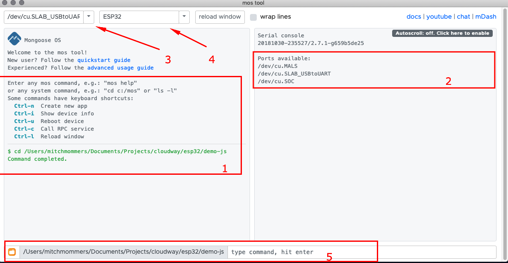

The screen is devided in some textaraea's and dropdown menu's the nummber that you see above mean:

1. Here you will see the output of your **commands**
2. Here you will see the output from your **device**
3. here you can select the port used to communicate with your device
4. Here you can select the type of device that you are using
5. Here you can enter commands (os spefific fi. ls and mos commands).

Now start with selecting the right port, you can do this by selecting the dropdown box and selecting the right port for linux/unix users this will be `/dev/cu.SLAB_USBtoUART` (or alike) for windows users it can be a port that starts with `COM` followed by a number fi. `COM3`.

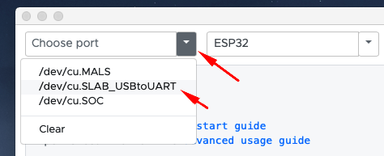

If your device type isn't selected yet, than do so by selecting the dropdown-box and clicking on `esp32`.

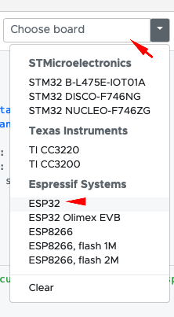

Next up is navigating to our workspace (folder). You can do this by selecting the orange folder box button  and navigating to your workspace folder.

Another option is to use command input to enter commands.

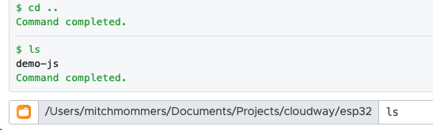

When you get into the right folder, you can continue to the next step.

## Cloning the boilerplate

> For this part your need GIT installed or you can download the zip file and unzip it on your computer. We are going to show the GIT method. The boilerplate however can be found here: [https://github.com/becloudway/iot-in-the-cloud-workshop-boilerplate](https://github.com/becloudway/iot-in-the-cloud-workshop-boilerplate)

You can clone the boilerplate by using the command down here, so open up a terminal in your workspace and go for it.

```sh
git clone --depth=1 --branch=master https://github.com/becloudway/iot-in-the-cloud-workshop-boilerplate.git rule-upgrade && rm -rf rule-upgrade/.git
```

This will clone the project and remove the .git history etc. so that you have a clean folder to work with.

## Let's get started


### Step 1

Now in your MOS UI navigate towards the folder using the  icon.
The folder's name should be rule-upgrade.

Your path should look something like this.

```
Windows: c:\users\youruser\...\workspace\love-note

Unix\Linux: /Users/youruser/.../workspace/love-note
```

When you run the following command:

```sh
// windows
tree

// Linux/Unix
find .
```

It should show you the following file/folder structure:

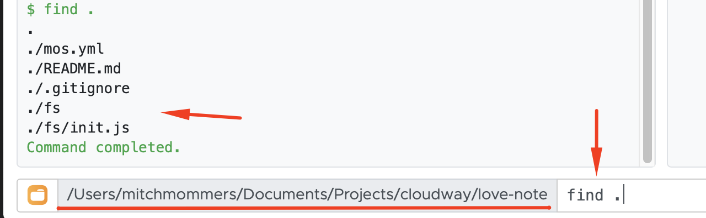

The most important files are `./mos.yml` and `./fs/init.js` so let me explain these to you.

`mos.yml`

This is the mos definition file used for building your project, it contains references to the libraries you use and information about your target platform etc. You can open the file and check it out if you like but we did the setup for you.

`./fs/init.js`

This file holds your code, in this file we will be working.

### Step 2

Let's open `./fs/init.js` in your favorite code editor, so that we can start coding.

When you open the file it should have the following content:

```js
// Load some dependencies
load('api_aws.js');
load('api_config.js');
load('api_gpio.js');
load('api_mqtt.js');
load('api_timer.js');
load('api_sys.js');
load('api_pwm.js');

/*
* We used pin 15 as an additional 3.3v power pin because our breadboards where a bit to small :D
* But as you can see we got a workaround for that.
*/

// ----------------------- THIS PART IS FOR 3.3v POWER ON PIN 15
let ADDITIONAL_POWER = 15;

GPIO.set_mode(ADDITIONAL_POWER, GPIO.MODE_OUTPUT);
GPIO.write(ADDITIONAL_POWER, 1);
// ----------------------- DON'T CHANGE THIS

// Where your code starts
// You can remove the timer down here.

Timer.set(1000, Timer.REPEAT, function () {
    print("Hello World!");
}, null);
```

The first lines load the modules that we use in our code, fi. the aws api so that we can communicate with AWS. But it also loads basic functionality from mongoose os.

For the tutorial we will focus on everything underneath the following line:

```js
// Where your code starts
```

There is a timer down there so we will first check if everything is set up correctly. We will do this by finally running a program on our ESP32.

So how do we get started, well make sure that you now connect your ESP32 to your computer. And open up the MOS UI.
Make sure that you are connected to your device and selected the right device type.


Next enter the following command: `mos build` this will send your code and mos.yml towards the mongoose cloud server that builds your code and sends back a nice packaged firmware that you can flash onto your device.

Your output should look similar to this:

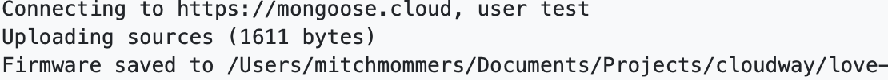

> If you whant to learn more about flashing and firmware [click here](https://en.wikipedia.org/wiki/Firmware) :)

Now we need to flash our firmware onto our device. We can do this by running `mos flash` this will start the flashing process as you can see in the left panel. This can take some time.

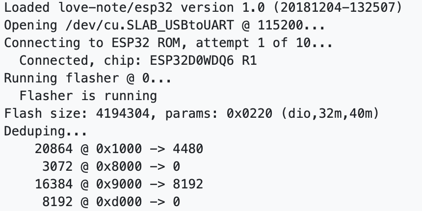

When all that flashing is done, our project will start up and show us some `hello world!` in the right panel.

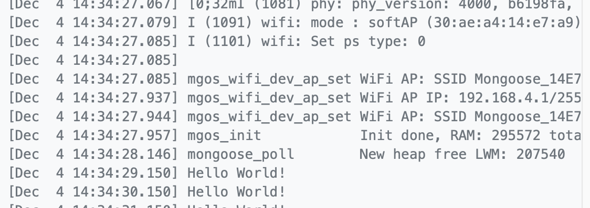

That's it for this part, now you have a running `hello world` example, congratulations!

### Step 3

Now let's get down to business, we will need to write some code that allows us to connect to AWS and receive a MqTT message.
So to start we will remove the timer because we don't need that one anymore. When that is removed, we can start coding below.

```js
// Where your code starts
```

/images/content.png)

The most important files are `./mos.yml` and `./fs/init.js` so let me explain these to you.

`mos.yml`

This is the mos definition file used for building your project, it contains references to the libraries you use and information about your target platform etc. You can open the file and check it out if you like but we did the setup for you.

`./fs/init.js`

This file holds your code, in this file we will be working.

### Step 3 - Connecting To AWS

Before we can send anything we need to connect to AWS. We will start with logging in to the AWS console. If you don't have an account make sure to register (for our workshop we provide accounts).

So let's get started by going to the AWS console by [clicking here](https://eu-west-1.signin.aws.amazon.com). Enter you alias, username and password (during the workshop you will get our alias, iam username and password). Hit `Sign In`.

Now that you are in the AWS Console you have to find IAM, you can do this by clicking the search box and enter `iam` and then clicking on `IAM`.


Now you should see the IAM Console

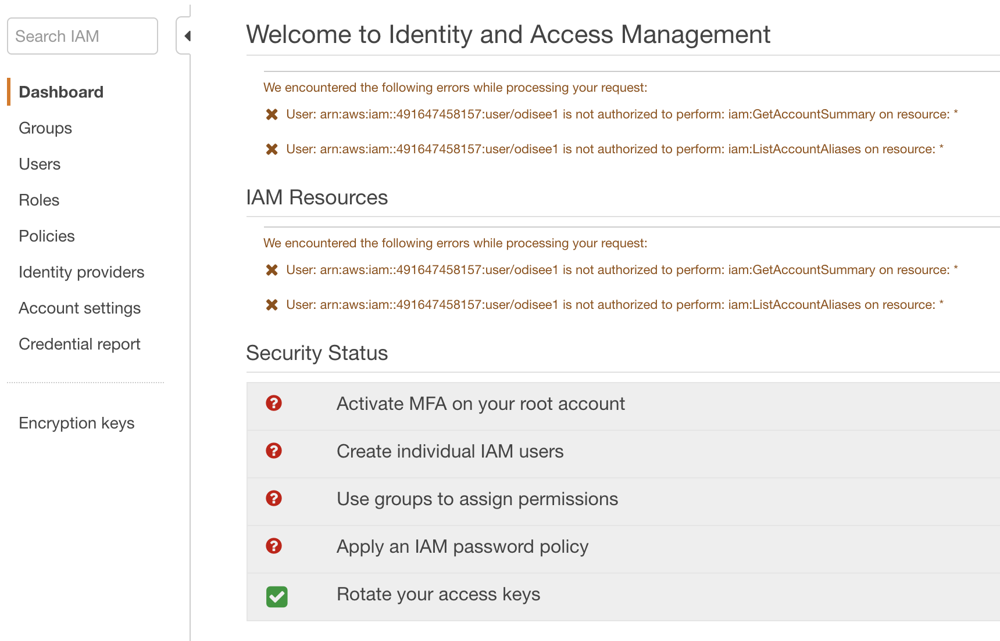

On the left you can click on `Users` which should bring you to the user list, here you should click on your user.

Now go to the `Security Credentials` tab.

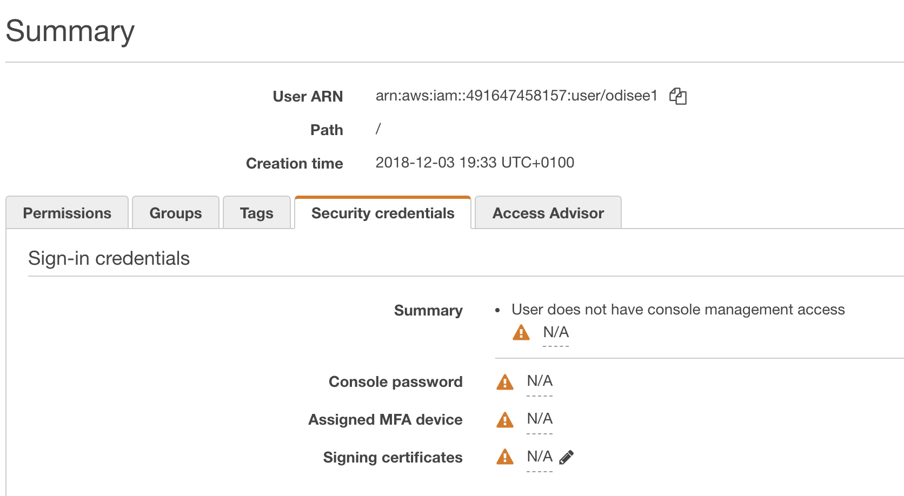

Scroll down a bit and you will find the `Create access key` button, click on it and it will show you the following pop-up.

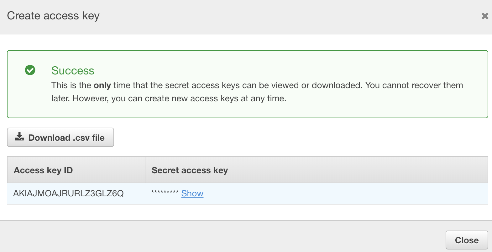

Make sure to hit `download .csv file` to save your credentials and if you like you can copy and note your `access key id` and `secret access key`. You will need these in the next step.

Now go back to the MOS UI for the next part.

Next there are two things that you need to do:

1. Connecting your ESP32 to the WIFI
2. Setup AWS IOT for your ESP32

Both are easy thanks to the people of Mongoose Os.

**Connecting to WIFI**

In the MOS UI enter the following command:

```sh
mos wifi <SSID> <WIFI_PASSWORD>
```

Replace <SSID> with your WiFi accespoints SSID and WIFI_PASSWORD with your WiFi password.

When everything goes well you should see a message like:

```sh
mgos_net_on_change_c WiFi STA: connected
```

**Setting up AWS IoT**

Lets setup our AWS credentials:

Open up a Terminal and enter the following command.

```sh
aws configure
```

When prompted enter your access key id and secret key. For the region enter `eu-west-1` and for default output format just hit enter.

Now restart MOS UI to make sure that it loaded your new credentials.

If you did setup your AWS credentials correctly it should be as easy as entering:

```sh
mos aws-iot-setup
```

This will run some commands using the AWS CLI and create the required certificates. Then it will upload the certificates to your device and connect to AWS.

That's it you are now connected to AWS, congratulations!

### Step 4 - Sending the data to the cloud

For our example we keep it simple, we will use the timer and add a very simple method provided to us by the people behind Mongoose Os to publish a MqTT message every 30 seconds.

To do so you can replace the following line:
```js
// <TIMER>
print("Hello World!");  // this line
```

And change it to this:
```js
MQTT.pub("iot/team_name/rule/upgrade" /* topic */, JSON.stringify({ message: "Hello World!" }) /* message */, 0);
print("Message send");
```

Next change the timer's interval to 30000 by changing the 1000 to 30000 (which is in miliseconds).

So that your code now looks like this:

```js
// Load some dependencies
load('api_aws.js');
load('api_config.js');
load('api_gpio.js');
load('api_mqtt.js');
load('api_timer.js');
load('api_sys.js');
load('api_sys.js');
load('api_pwm.js');

/*
* We used pin 15 as an additional 3.3v power pin because our breadboards where a bit to small :D
* But as you can see we got a workaround for that.
*/

// ----------------------- THIS PART IS FOR 3.3v POWER ON PIN 15
let ADDITIONAL_POWER = 15;

GPIO.set_mode(ADDITIONAL_POWER, GPIO.MODE_OUTPUT);
GPIO.write(ADDITIONAL_POWER, 1);
// ----------------------- DON'T CHANGE THIS

// Where your code starts

Timer.set(30000, Timer.REPEAT, function () {
    MQTT.pub("iot/team_name/rule/upgrade" /* topic */, JSON.stringify({ message: "Hello World!" }) /* message */, 0);
    print("Message send");
}, null);
```

So what happens here? Well every 30 seconds we publish a message using the `MQTT.pub` function. This message will be send to the Topic `iot/team_name/rule/upgrade` and as message we used the `JSON.stringify` method to turn our `Object` `{message: "Hello World!"}` into normall text. We turned it into "normall text", because the `MQTT.pub` method is unable to send an `Object`.

Go back to your MOS UI which should still be set correctly, so make sure that you are in the right folder and have the right port/device type selected.

Then enter the following commands:

```sh
mos put fs/init.js
mos call Sys.Reboot
```

This will upload your updated code and reboot your device.

Now after 30 seconds you should see a message in your console saying `Message send`.
And if you are connected to the internet over WiFi and to AWS the message should now be send to AWS's MqTT broker.

### Step 5 - Validating that our messages are being send

For this part we have to get back into the AWS Console and search for `IoT Core` now open up `IoT Core` and you should see the following screen.

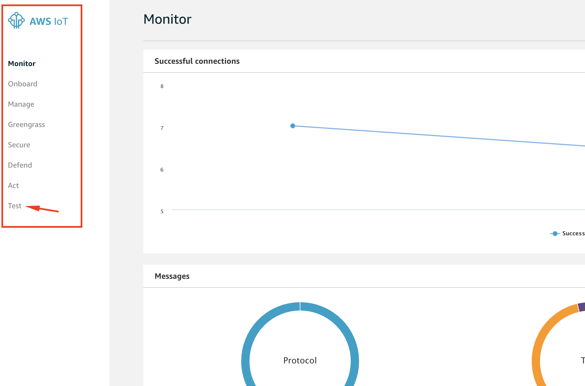

Click on `Test` at the left side.

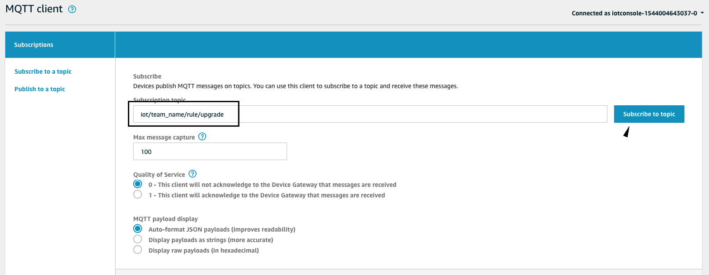

You should now see the above page, here you can subscribe to your topic by filling in the topic name and clicking on `Subscribe to topic`.

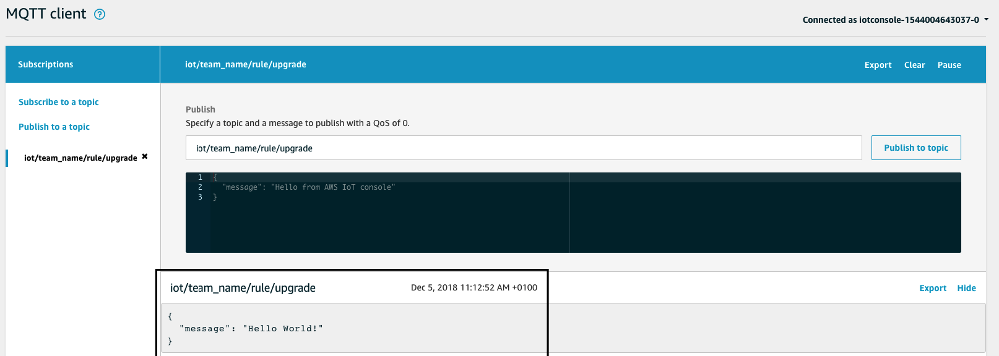

It can take up to 30 seconds but eventually you should see a message. With that all set and done, we can continue on the next part, creating our rule.

### Step 6 - Creating a Rule

In the left side bar where you previously pressed `Test` select `Act`. You will be shown the `Rule Engine Page` if you never made a Rule before, you can select `Create a rule` if you did you can still select `Create a rule` but the page will also show you existing `Rules`.

You should now see a page like this:

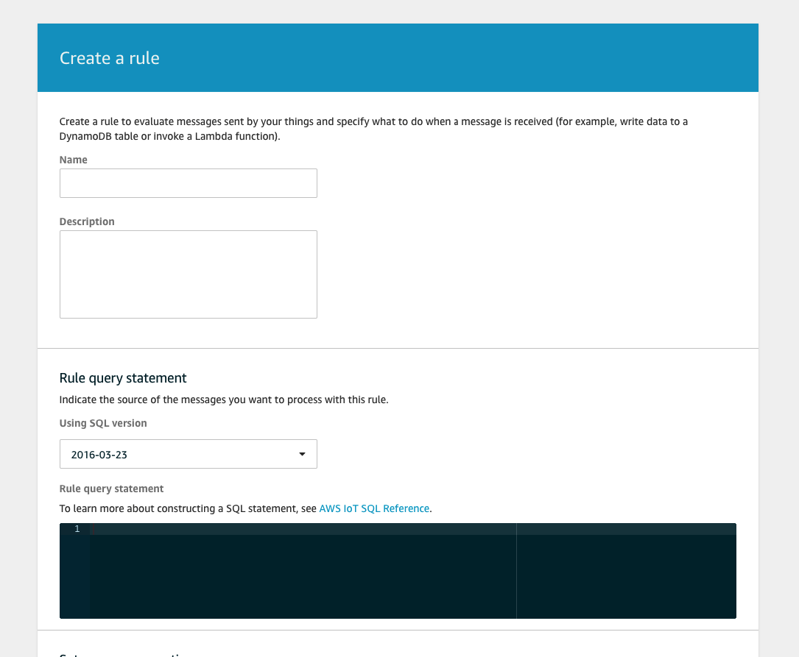

For the name fill in: `iot_teamname_dynamodb_rule` you can fill in a description if you want but it's optional.

Then we have the Rule Query Statement keep the version as it is and for the query fill in:

```sql
SELECT * as message FROM "iot/team_name/rule/+"
```

This will just select the entire body from the message. The from part is our `Topic`.
We could also do for instance:

```sql
SELECT * FROM "iot/teamname/rule/+"
```

`newuuid() as uuid` will create a new UUID and assign it as the property uuid. So that we can later use this generated uuid as a primary key for our DynamoDB entry.

> For more information about these functions read the [iot sql function aws developerguide](https://docs.aws.amazon.com/iot/latest/developerguide/iot-sql-functions.html)

This would match everything starting with `iot/teamname/rule/` and `+` is a wildcard for 1 or more.
So it would match:

- iot/teamname/rule/test
- iot/teamname/rule/upgrade
- iot/teamname/rule/somethingelse

You can also use `#` which is also a wildcard but it just matches everything that comes after the prefix.

For instance `iot/teamname/rule/#` would match:

- iot/teamname/rule/test/upgrade/firmware
- iot/teamname/rule/test/upgrade
- iot/teamname/rule/test/something/else

> You can also do various other things like select a certain value from your topic, ... to learn more about this I refere you to the following page: [iot sql reference](https://docs.aws.amazon.com/iot/latest/developerguide/iot-sql-reference.html)

Next we need to add an action, we do this by clicking on the `Add action`. This will bring you to the page previewed here:

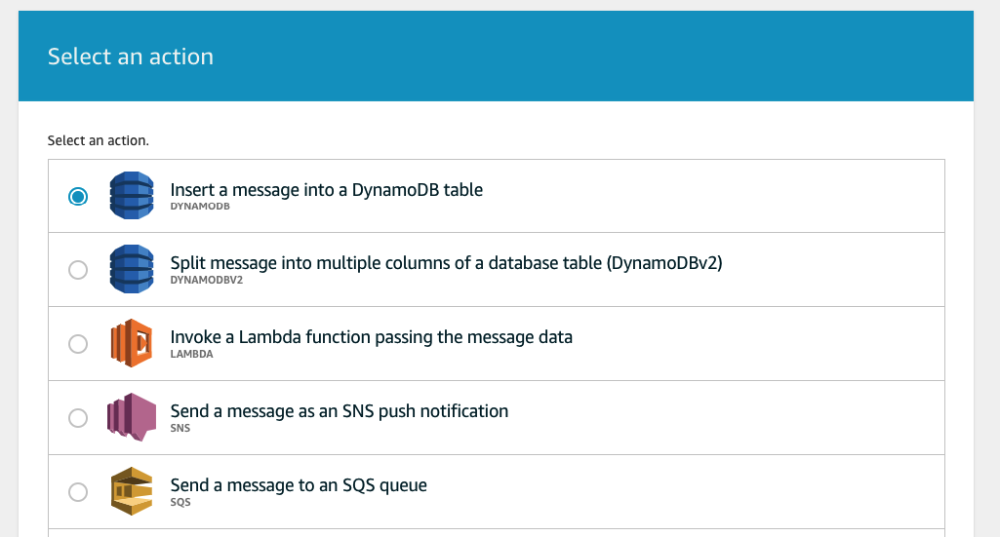

Now select dynamodb by clicking on the `round radio button` next to it and scroll down and click on the button `Configure Action`.

This should show you the following page:

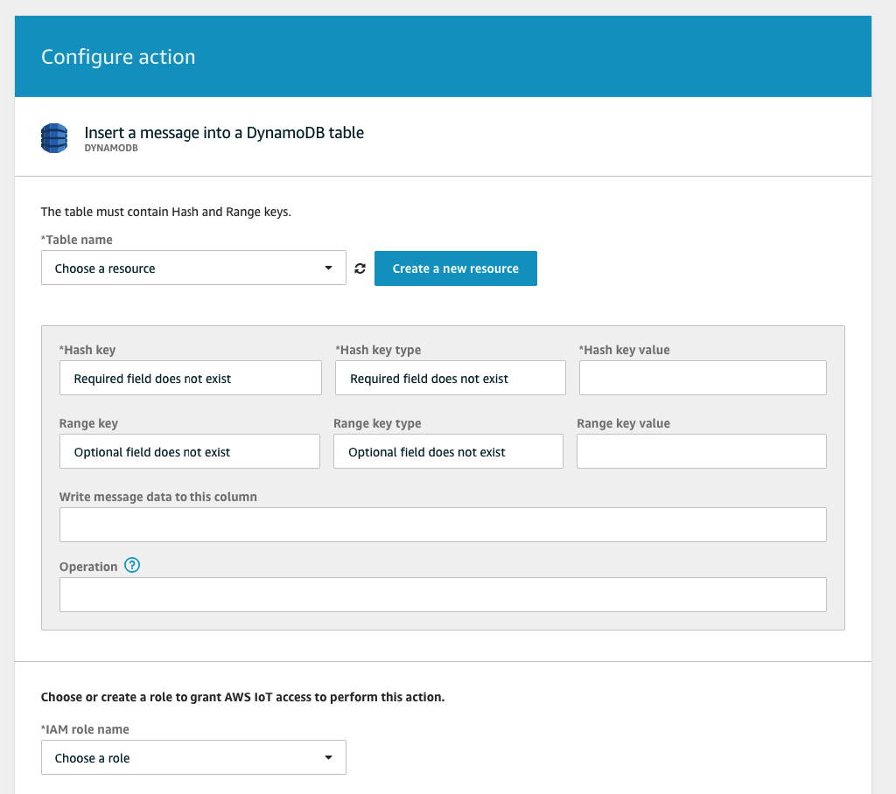

We need to create a new dynamodb table to store the message in. We do this by clicking on `Create a new resource` this will open a new tab with the DynamoDB console.

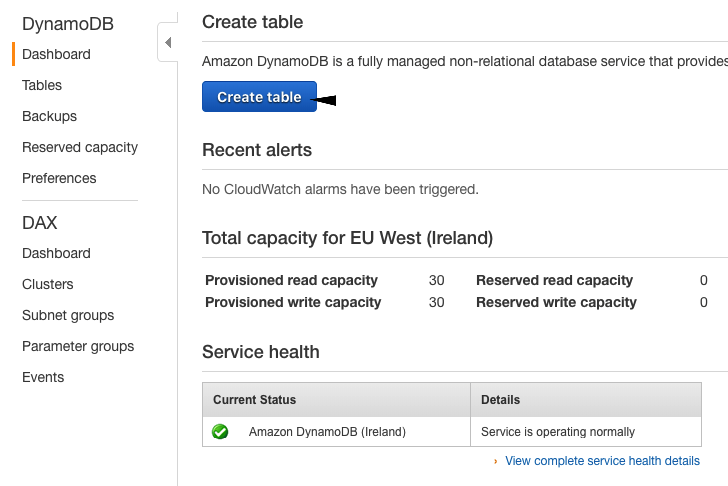

Click on `Create Table` on the next page fill in the following fields like shown in the picture below.

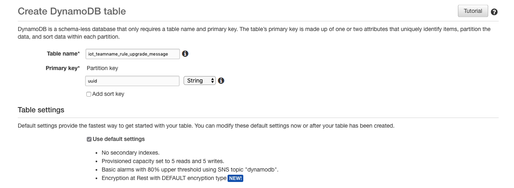

After you filled in all the fields of the table with the correct information, press the `Create` button at the bottom right.

When this is done you, you will be send to the DyanmoDB table overview and you will see that the table is being provisioned.

Now go back to your IoT rule page, click on the `refresh button` to refresh your results and now you should be able to select your newly created table. (The refresh button is an icon, which should be at the left side of the `Create a new resource` button!).

Now you can fill in some new fields, use the values from the fields down below:

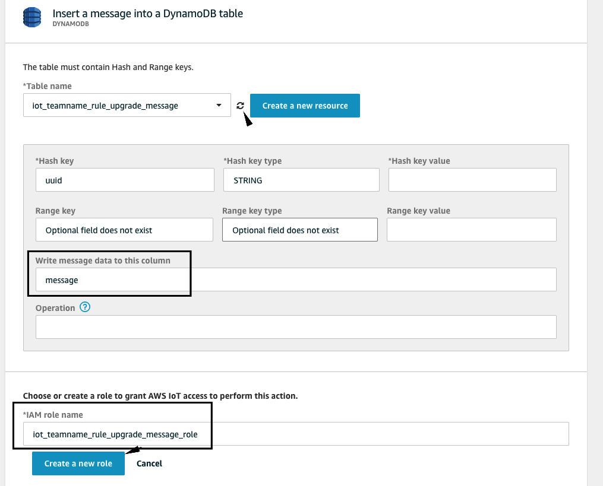

To create the role you have to press the `Create a new role` button then fill in the name and press the `create a new role button` again.

And at last, in your `Hash Key value` fill in `${newuuid()}` this will generate a random uuid for each entry.

When this is all done hit `Create` and your IoT Rule will be created, you are send back to the Rule page showing an overview of you rule. You can click on the small arrow symbol to open up your action's settings.

It should look like this:

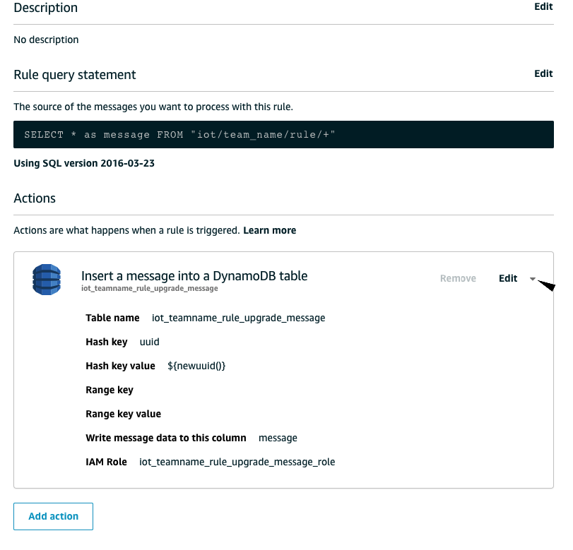

Now you can go to dynamodb's page again and click on your table.

Each 30 seconds you should get a message in your DynamoDB table:

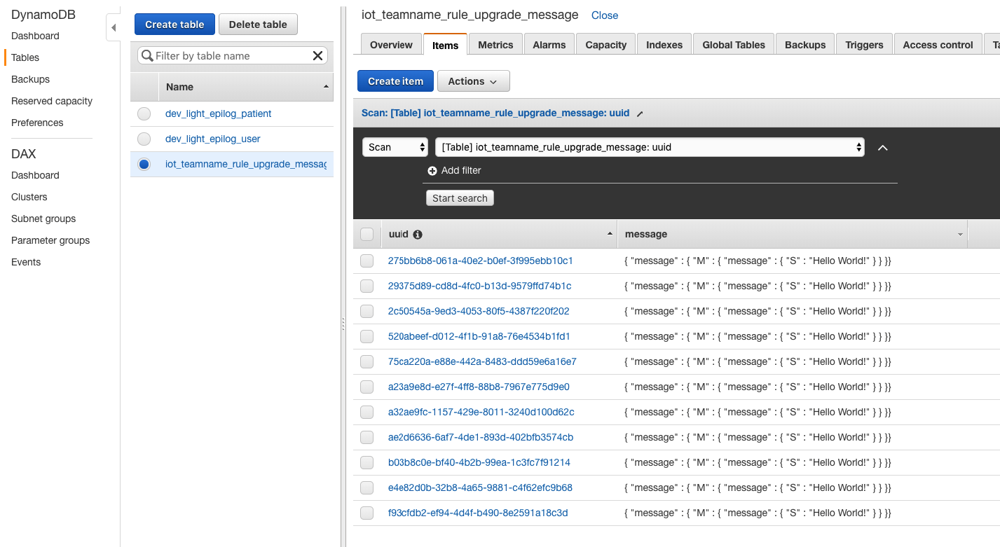

So that's it you created an IoT Rule with the power to add MqTT messages into your DynamoDB table. You can do alot of things with the IoT Rules, for instance trigger a lambda. You might whant to experiment with that.

We hope you enjoyed this guide, and that you learned something new. If you have some points of imporvement open an issue or make a pull request.